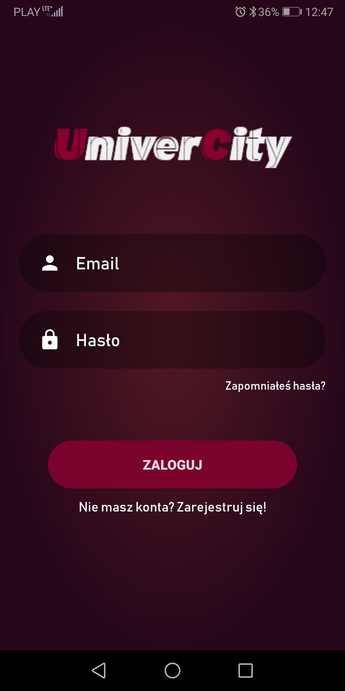
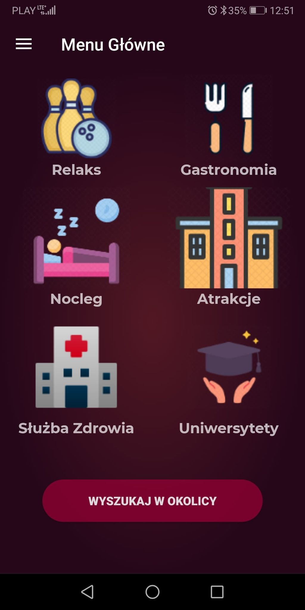
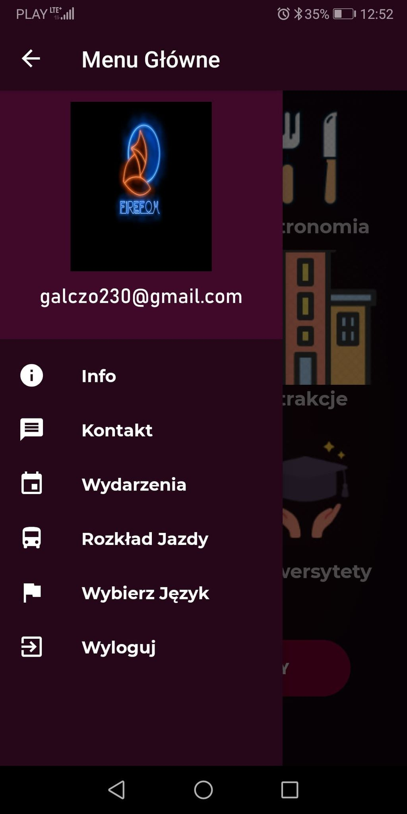
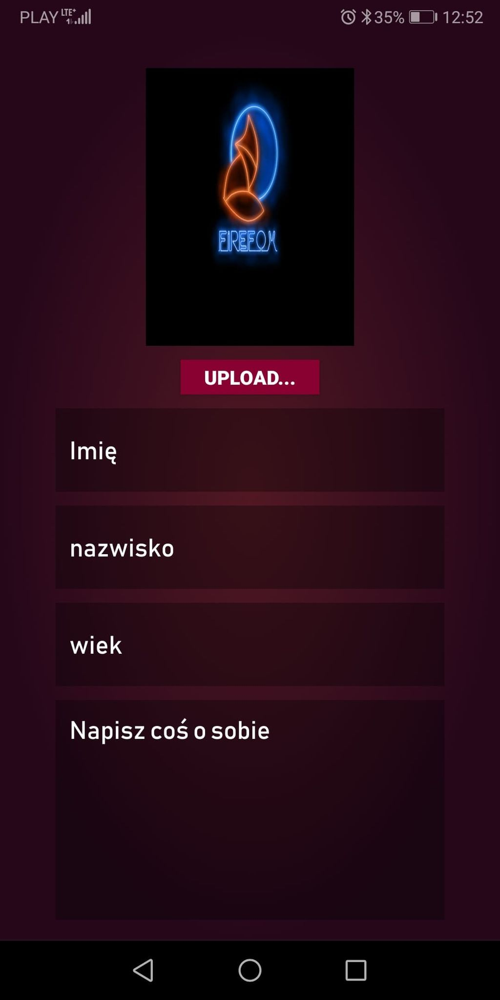
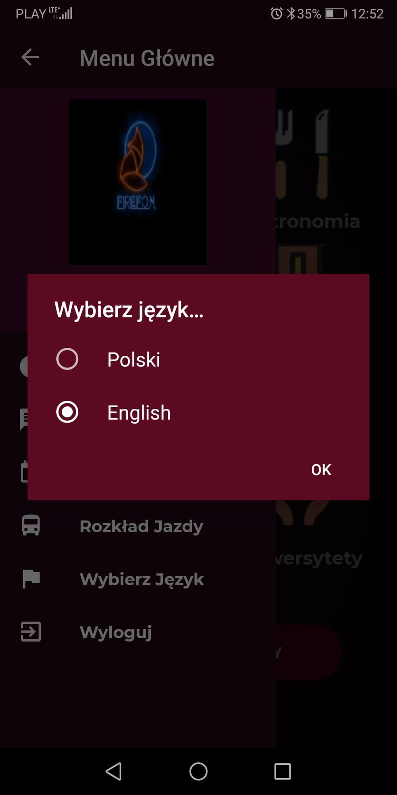
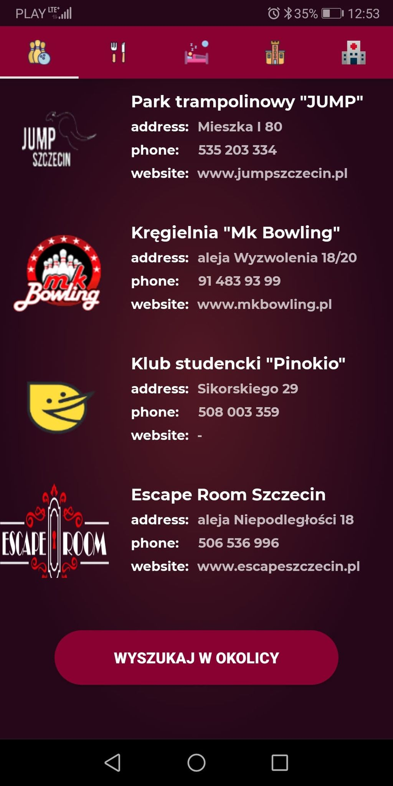
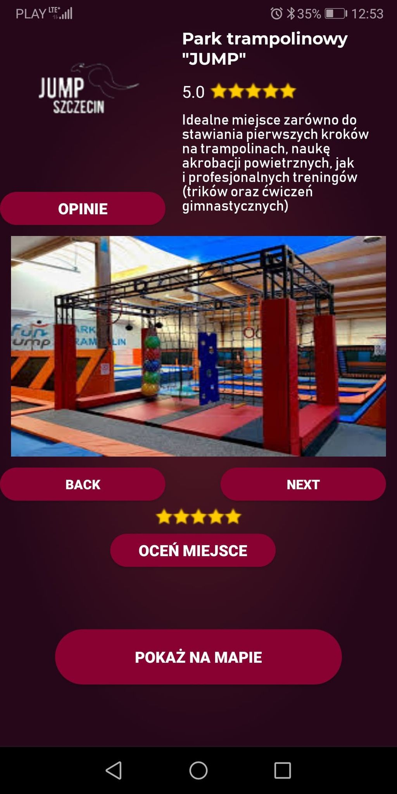
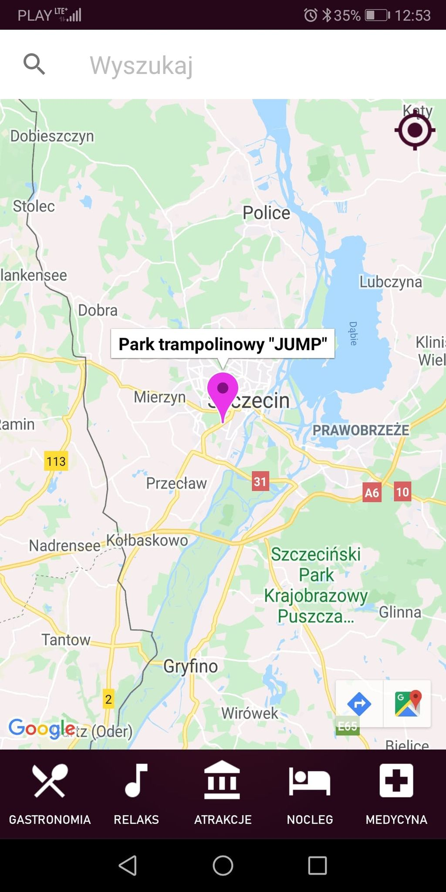
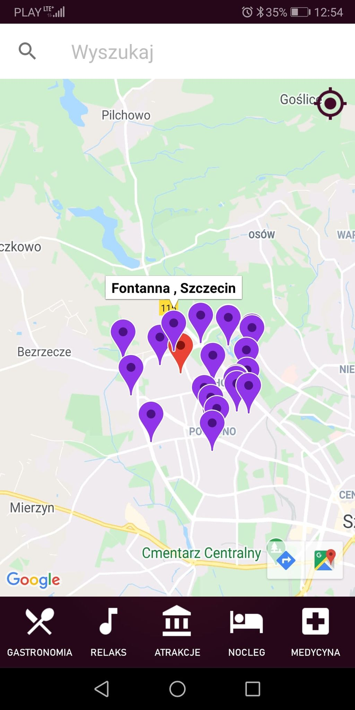

# UniverCity

My first Android app. The Applicaton was created to help the user find himself in Szczecin by providing information on objects such as local attractions, lodging, dining, along with an indication of their location on Google maps. The application has two language versions (Polish and English). Additionally, it contains links to other useful applications, such as public transport timetables. It allows to search for places of the chosen category in the user nearby area. The Android Studio environment and the non-relational Firebase database were used to make the application prototype. Application was written in Java.

Screens are placed below: 

  
  
  
  
  
  
  
  
  

